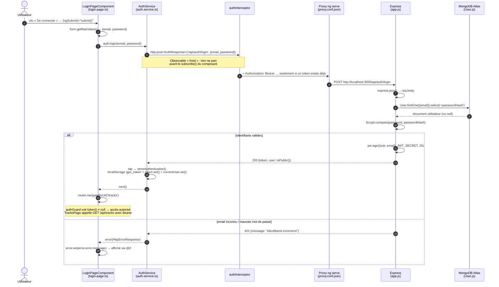

# TP1 — Mission 0 : cartographie de l'application

Analyse réalisée **sans modifier le code** (frontend `frontend-starter/` et backend `backend/`).

## 1. Éléments demandés

| Élément | Où ? | Rôle |
|---|---|---|
| Point d'entrée | [frontend-starter/src/main.ts](frontend-starter/src/main.ts) | `bootstrapApplication(AppComponent, { providers })` démarre l'application standalone (pas de `NgModule`). |
| Composant racine | [components/app/app.ts](frontend-starter/src/app/components/app/app.ts) + [app.html](frontend-starter/src/app/components/app/app.html) | Sélecteur `app-root` : en-tête, navigation (`routerLink`) et `<router-outlet />` où s'affiche la page courante. |
| Configuration des routes | [app/routes.ts](frontend-starter/src/app/routes.ts), enregistrée par `provideRouter(routes)` dans `main.ts` | `''` → `tracks`, `login`, `register` (publiques), `profile` et `tracks` protégées par `canActivate: [authGuard]`, `**` → `tracks`. |
| Enregistrement de `HttpClient` | `main.ts` ligne 11 : `provideHttpClient(withInterceptors([authInterceptor]))` | Rend `HttpClient` injectable partout et branche l'intercepteur fonctionnel. |
| Modèles | [shared/models/](frontend-starter/src/app/shared/models/) | `User`, `AuthResponse {token, user}`, `Track`, `Page<T>` : interfaces TypeScript qui reflètent les JSON de `API_CONTRACT.md`. |
| Services | [shared/services/auth.service.ts](frontend-starter/src/app/shared/services/auth.service.ts), [track.service.ts](frontend-starter/src/app/shared/services/track.service.ts) | Seuls fichiers qui appellent `HttpClient`. `AuthService` porte l'état (`token` et `currentUser` sont des Signals) et le `localStorage` (`gpc_token`). |
| Pages | [components/login-page](frontend-starter/src/app/components/login-page/), [register-page](frontend-starter/src/app/components/register-page/), [profile-page](frontend-starter/src/app/components/profile-page/), [tracks-page](frontend-starter/src/app/components/tracks-page/) | Composants standalone chargés par le routeur ; ils injectent un service avec `inject()`. |
| Garde de route | [shared/guards/auth.guard.ts](frontend-starter/src/app/shared/guards/auth.guard.ts) | `authGuard` : si `auth.token()` est vide → `UrlTree` vers `/login`. |
| **Ajout du JWT** | [shared/interceptors/auth.interceptor.ts](frontend-starter/src/app/shared/interceptors/auth.interceptor.ts) | `authInterceptor` lit `AuthService.token()` ; s'il existe, clone la requête avec `Authorization: Bearer <token>`. |
| Proxy de dev | [frontend-starter/proxy.conf.json](frontend-starter/proxy.conf.json) | `ng serve` relaie `/api/*` vers `http://localhost:3000` : le navigateur ne voit qu'une seule origine (`localhost:4200`). |
| API | [backend/src/app.js](backend/src/app.js) (routes + middleware `auth`), [server.js](backend/src/server.js) (connexion MongoDB, compte démo, port) | Express 5 + Mongoose. |
| Modèle MongoDB | [backend/src/models/User.js](backend/src/models/User.js) | Schéma `User`, hachage bcrypt, `verifyPassword()`, `toPublic()` (jamais de `passwordHash` renvoyé). |

## 2. Schéma annoté : clic sur « Se connecter »



Version texte (si Mermaid n'est pas rendu) :

```text
[login-page.html] (ngSubmit)
      │
      ▼
[LoginPageComponent.submit()] ── inject(AuthService)
      │  auth.login(email, password).subscribe(...)
      ▼
[AuthService.login()] ── HttpClient.post('/api/auth/login', {email,password})
      │                   .pipe(tap(storeAuthentication))
      ▼
[authInterceptor] ── ajoute "Authorization: Bearer <token>" si token() existe
      │
      ▼
[proxy ng serve :4200] ──► [Express :3000] POST /api/auth/login (route publique)
                                │ express.json → User.findOne → bcrypt.compare
                                ▼
                           [MongoDB Atlas] collection users
                                │
      ┌─────────────────────────┴──────────────────────────┐
  200 {token,user}                                    401 {message}
      │                                                    │
  tap: localStorage.setItem('gpc_token')             subscribe.error
       token.set / currentUser.set                   error.set(message) → @if (error())
      │
  subscribe.next → router.navigateByUrl('/tracks') → authGuard OK
```

## 3. Routes publiques et routes protégées (`API_CONTRACT.md`)

La protection est réalisée côté backend par le middleware `auth` passé en 2ᵉ argument de la route (`app.get('/api/users/me', auth, …)`). Il vérifie le préfixe `Bearer `, la signature et l'expiration du JWT, puis place l'identité dans `req.auth.sub`.

| Méthode | Route | Accès | Middleware `auth` | Utilisée par (front) |
|---|---|---|---|---|
| GET | `/api/health` | **Publique** | non | — (test manuel) |
| POST | `/api/auth/register` | **Publique** | non | `AuthService.register()` |
| POST | `/api/auth/login` | **Publique** | non | `AuthService.login()` |
| GET | `/api/users/me` | Protégée (JWT) | oui | `AuthService.profile()` |
| PUT | `/api/users/me` | Protégée (JWT) | oui | `AuthService.update()` |
| GET | `/api/tracks?page&limit` | Protégée (JWT) | oui | `TrackService.list()` |
| POST | `/api/tracks` (multipart) | Protégée (JWT) | oui | `TrackService.upload()` |
| GET | `/api/tracks/:id/audio` | Protégée (JWT) | oui | `TrackService.audio()` |
| DELETE | `/api/tracks/:id` | Protégée (JWT) | oui | non utilisée (bonus) |

Sans en-tête valide, une route protégée répond `401 {"message": "Authentification requise"}` ou `401 {"message": "Jeton invalide ou expiré"}`.

Deux niveaux de protection à ne pas confondre :

- **`authGuard` (Angular)** : confort d'interface, il vérifie seulement qu'un token est *présent* dans le navigateur. Il ne garantit rien : n'importe qui peut modifier le `localStorage`.
- **middleware `auth` (Express)** : vraie sécurité, il vérifie la *signature* et l'*expiration* avec le secret qui ne quitte jamais le serveur.

## 4. Où voir les traces ?

- **Frontend** : console des DevTools (`console.debug` / `console.error` préfixés `[LoginPage]`, `[TracksPage]`…). Activer le niveau « Verbose » pour voir les `debug`.
- **Requêtes HTTP** : DevTools → Network → filtre Fetch/XHR (méthode, URL, en-têtes, payload, statut, réponse).
- **Backend** : le terminal où tourne `npm start` dans `backend/` (logs `[http]`, `[auth]`, `[user]`, `[tracks]`). Le middleware de journalisation affiche `méthode URL -> statut (durée)` sans jamais afficher les corps (mots de passe) ni les tokens.

## 5. Constats utiles pour la Mission 1 (pas encore corrigés)

1. **Pas de bouton de déconnexion** dans `app.html`, alors que `AuthService.logout()` existe ; le lien « Connexion » reste affiché même connecté.
2. **Aucune gestion du `401`** : un token expiré reste dans le `localStorage`, `authGuard` laisse passer, puis les appels échouent sans retour vers `/login`.
3. **Soumission sans contrôle de validité** : `submit()` n'utilise pas `form.invalid`, et aucun message de validation n'est affiché.
4. **Validations front ≠ back** : le backend exige un mot de passe de 8 caractères minimum et un nom d'au moins 2 caractères (`User.js`), le front ne vérifie que `required`.
5. **`currentUser` perdu au rechargement** : seul le token est relu depuis `localStorage` ; l'utilisateur reste `null` tant que `/api/users/me` n'est pas appelé.
6. **Profil non chargé automatiquement** : il faut cliquer sur « Charger mon profil ».
7. **L'intercepteur ajoute le token à toutes les requêtes**, y compris `/api/auth/login` et `/api/auth/register` (sans conséquence ici car le backend l'ignore, mais inutile).
8. Les identifiants démo sont pré-remplis dans le formulaire de connexion (pratique en TP, à retirer ensuite).
