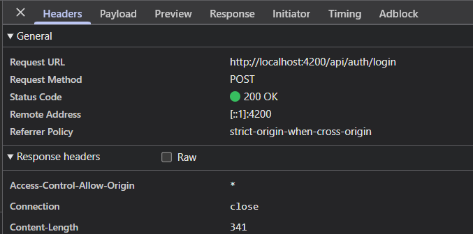
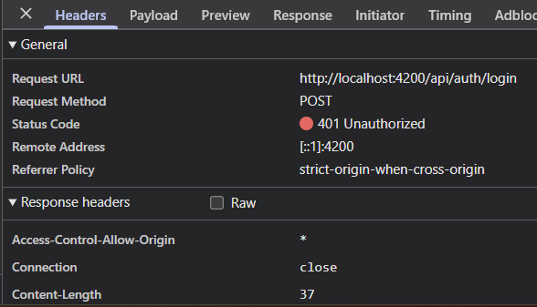

# Rapport d'usage de l'IA - TP1

Pour chaque mission, détailler et fournir des explications concernant : objectif; prompt principal; plan proposé par l'agent; vérifications réalisées par le binôme; erreurs ou propositions rejetées; fichiers effectivement modifiés; preuve de fonctionnement; ce que chaque membre sait maintenant expliquer sans l'agent.

## Outil et modèle

Nous avons utilisé Claude Code dans VS Code, avec le modèle Claude Opus 5.5.

On voit le modèle actif avec la commande `/model`. On voit la consommation de la session avec `/cost`. Les tokens comptent le prompt, les fichiers lus, l'historique et la réponse. Une longue conversation consomme donc plus, même avec des questions courtes.

Pour choisir un modèle, on peut demander conseil à l'assistant lui-même (voir `CONSEILS_POUR_UTIISER_ASSISTANT_AI.md`, partie 10). La documentation du fournisseur et l'enseignant peuvent aussi conseiller. Un modèle rapide suffit pour expliquer une notion. Un modèle plus puissant est utile pour analyser plusieurs fichiers ou chercher un bug difficile.

## Mission 0 - Cartographier l'application

**Objectif** : sans modifier le code, retrouver le composant racine, les routes, l'enregistrement de `HttpClient`, les modèles, services et pages, et le mécanisme qui ajoute le JWT. Faire un schéma du flux « Se connecter ». Séparer les routes publiques et protégées.

**Prompt principal** : « Faisons la mission 0 du TP 1 Sujet etudiant. »

**Démarche de l'agent** :

1. Lecture du sujet, du guide d'usage de l'IA, de `frontend-starter/CLAUDE.md` et de `API_CONTRACT.md`.
2. Lecture des fichiers de `frontend-starter/src` et de `proxy.conf.json`.
3. Lecture du backend : `src/app.js`, `src/server.js`, `src/models/User.js`.
4. Rédaction de la cartographie, du schéma et du tableau des routes.

Aucun build ni test n'a été lancé, car c'est une mission d'analyse. Le fichier `.env` n'a pas été lu.

**Fichiers modifiés** : aucun fichier de code. Nous avons créé `MISSION_0_CARTOGRAPHIE.md` et ce rapport.

**Production** : voir [MISSION_0_CARTOGRAPHIE.md](MISSION_0_CARTOGRAPHIE.md).

**Vérifications réalisées par le binôme** :

- Nous avons ouvert les fichiers cités pour vérifier les rôles décrits.
- Nous nous sommes connectés avec le compte démo.
- Dans Network, `POST /api/auth/login` part sans header `Authorization`. C'est normal, la route est publique.
- Les logs `[http]` et `[auth]` s'affichent dans le terminal du backend, pas dans le navigateur.

**Erreurs ou propositions rejetées** : aucune proposition rejetée. Au premier essai, le login renvoyait `502 Bad Gateway`. Le backend n'était pas lancé, donc le proxy d'Angular ne trouvait rien sur le port 3000.

**Preuve** : voir les captures de la mission 1 ([login réussi](captures/login-reussi.png), [login refusé](captures/login-echoue.png)).

**Ce que chaque membre sait expliquer sans l'agent** :

- `provideHttpClient(withInterceptors([...]))` rend `HttpClient` disponible et branche l'intercepteur.
- L'intercepteur ajoute le JWT aux requêtes.
- `authGuard` vérifie seulement qu'un token existe dans le navigateur. Le middleware `auth` du backend vérifie vraiment le token. C'est lui qui protège les données.
- La requête HTTP ne part qu'au moment du `subscribe()`.
- Le proxy de `ng serve` envoie les appels `/api` vers `localhost:3000`.

## Mission 1 - Inscription, connexion et profil

**Objectif** : compléter la partie utilisateur : formulaires validés, JWT, Signal `currentUser`, redirections, déconnexion, profil et gestion du `401`.

**Prompt principal** : « Vas-y, que manque-t-il pour le TP1 ? »

**Démarche de l'agent** : l'agent a relu le sujet et les constats de la mission 0. Il a regardé les règles du backend : nom de 2 caractères minimum, mot de passe de 8 caractères minimum. Il a modifié seulement le frontend, puis lancé `ng build`. Le build passe.

**Fichiers modifiés** :

| Fichier | Changement |
|---|---|
| `shared/services/auth.service.ts` | ajout de `isAuthenticated` (computed) |
| `shared/interceptors/auth.interceptor.ts` | pas de token sur login et register ; sur un `401`, déconnexion et retour à `/login` |
| `shared/guards/auth.guard.ts` | garde la page demandée dans `returnUrl` |
| `shared/utils/api-error.ts` (nouveau) | transforme une erreur HTTP en message lisible |
| `components/app/app.*` | bouton Déconnexion et nom de l'utilisateur dans le menu |
| `components/login-page/*` | validation, messages d'erreur, bouton désactivé pendant l'envoi, message « session expirée » |
| `components/register-page/*` | mêmes règles que le backend, messages d'erreur |
| `components/profile-page/*` | chargement automatique du profil, messages de succès et d'erreur |
| `styles.css` | styles des messages et du bouton Déconnexion |

Les logs de la console n'affichent jamais le mot de passe ni le token.

**Réponses aux questions du sujet** :

- Routes backend utilisées : `POST /api/auth/register` et `POST /api/auth/login` (publiques), `GET /api/users/me` et `PUT /api/users/me` (protégées).
- Mise à jour du profil, côté front : le formulaire de `profile-page.html` appelle `save()` dans `profile-page.ts`. `save()` appelle `update(name)` dans `auth.service.ts`, qui envoie `PUT /api/users/me`. L'intercepteur ajoute le token.
- Mise à jour du profil, côté back : dans `backend/src/app.js`, le middleware `auth` vérifie le token. La route `PUT /api/users/me` met ensuite le nom à jour avec `User.findByIdAndUpdate`. La règle sur le nom est dans `backend/src/models/User.js`.
- Signal et `localStorage` : le `localStorage` garde le token après un rechargement de la page. Mais Angular n'est pas prévenu quand il change. Un Signal est une valeur en mémoire. Quand elle change, l'affichage se met à jour tout seul. Elle est perdue au rechargement. Nous utilisons les deux : le token est sauvé dans le `localStorage` et recopié dans un Signal au démarrage.

**Vérifications réalisées par le binôme** :

- Connexion avec le compte démo : statut `200`, puis redirection vers la bibliothèque.
- Connexion avec un mauvais mot de passe : statut `401` et message « Identifiants incorrects ».
- `GET /api/users/me` avec le token : statut `200`.
- Ouvrir `http://localhost:4200/api/users/me` dans la barre d'adresse renvoie `401`. Le navigateur n'envoie pas le token, car il est dans le `localStorage` et pas dans un cookie. Seules les requêtes faites par `HttpClient` passent par l'intercepteur.

**Preuve** (checkpoint Network) :

| Requête | Méthode / URL | Corps envoyé | Statut | Réponse | `Authorization` |
|---|---|---|---|---|---|
| Connexion réussie | `POST /api/auth/login` | `{email, password}` | 200 | `{token, user}` | absent |
| Connexion refusée | `POST /api/auth/login` | `{email, password}` | 401 | `{"message":"Identifiants incorrects"}` | absent |
| Lecture du profil | `GET /api/users/me` | aucun | 200 | `{id, name, email, createdAt}` | `Bearer ***` |

Capture de `/api/users/me` à ajouter : `captures/users-me.png`.

**Erreurs ou propositions rejetées** :

- Le backend ne démarrait pas : MongoDB Atlas refusait la connexion. Notre adresse IP n'était pas autorisée. Nous l'avons ajoutée dans Atlas (Network Access).
- Le premier script de l'agent pour écrire les fichiers a échoué. Il a refait les fichiers un par un.
- Les identifiants démo restent pré-remplis dans le formulaire de connexion. C'est pratique en TP. Il faudra les enlever pour une vraie application.

**Ce que chaque membre sait expliquer sans l'agent** :

- Le trajet d'une connexion : composant, `AuthService`, intercepteur, proxy, Express, MongoDB.
- Pourquoi un composant n'appelle pas `HttpClient` directement : il passe par le service.
- Comment un `401` renvoie vers la page de connexion.
- La différence entre un Signal et le `localStorage`.
- Pourquoi la validation dans Angular ne remplace pas celle du backend.
